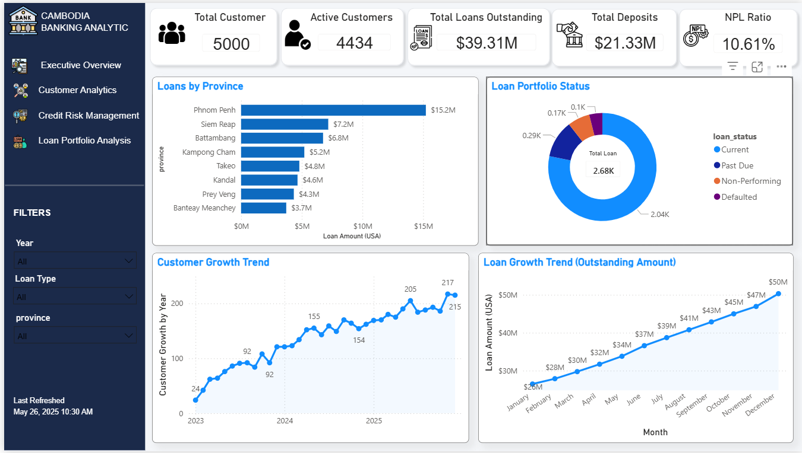
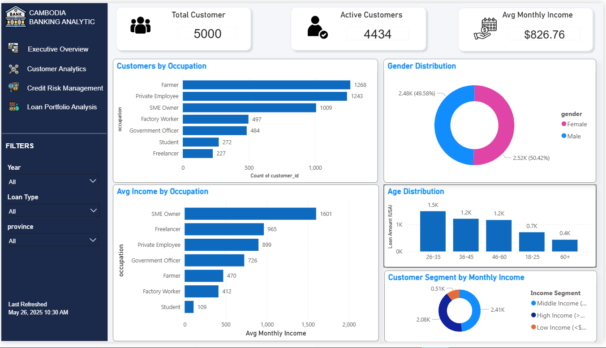
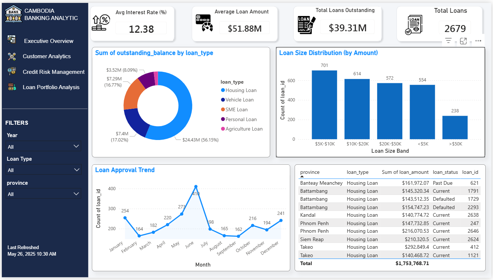
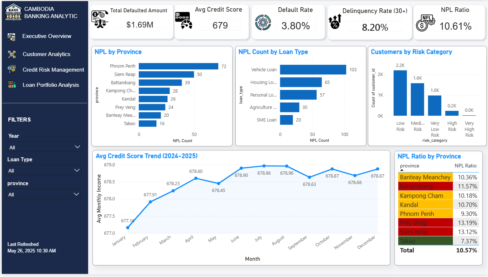

# Cambodia Banking Risk & Business Intelligence Platform

> A full end-to-end banking analytics portfolio project by **Anna Enne** — covering synthetic data generation, PostgreSQL data warehouse, SQL analysis, and interactive Power BI dashboards.

---

## 📊 Dashboard Preview

| Executive Overview | Customer Analytics |
|---|---|
|  |  |

| Credit Risk Management | Loan Portfolio Analysis |
|---|---|
|  |  |

---

## 🔍 Key Findings

| KPI | Value | Status |
|---|---|---|
| Total Customers | 5,000 | ✅ On Target |
| Active Customers | 4,434 (88.7%) | ✅ Healthy |
| Total Loans Outstanding | $39.31M | ✅ Strong |
| Total Deposits | $23.85M | ✅ Growing |
| NPL Ratio | 10.61% | ⚠️ Above Target |
| Average Credit Score | 680 | ✅ Low Risk Band |
| Total Defaulted Amount | $1.69M | 🔴 Needs Attention |
| Delinquency Rate (30+) | 6.23% | ⚠️ Watch List |

### Risk Highlights
- **Highest NPL Province:** Prey Veng (13.19%) — driven by 2024 Agricultural Stress Event
- **Riskiest Loan Type:** Vehicle Loan (11.2% NPL)
- **Safest Loan Type:** SME Loan (8.5% NPL)
- **Customer Growth:** +90% in 2024, +27% in 2025

---

## 🏗️ Project Structure

```
Banking-Risk-BI-Platform/
├── docs/                        ← 6 project documentation files
├── data/
│   ├── raw/                     ← Generated CSVs (output of python/main.py)
│   ├── processed/               ← Cleaned & validated CSVs
│   └── warehouse/               ← Archive / exports
├── python/
│   ├── config/
│   │   └── simulation_config.py ← All simulation parameters
│   ├── generators/              ← Phases 1–5, 9
│   ├── simulators/              ← Phases 6–8, 10
│   ├── etl/                     ← Phases 11–13
│   └── main.py                  ← Master orchestrator
├── sql/
│   ├── schema/                  ← DDL: create_tables.sql, constraints.sql
│   ├── business_analysis/       ← Customer growth, revenue, product KPIs
│   ├── risk_analysis/           ← NPL, default rate, exposure
│   └── branch_analysis/         ← Branch performance & risk
├── docker/
│   ├── Dockerfile               ← PostgreSQL 16 image
│   ├── docker-compose.yml       ← postgres + pgAdmin
│   ├── load_to_docker.py        ← Load CSVs into DB
│   └── init/                   ← Auto-run SQL on first start
├── powerbi/
│   ├── Banking_Risk_BI.pbix     ← Power BI dashboard file
│   └── screenshots/             ← Dashboard screenshots
├── reports/
│   └── Executive_Summary_Anna_Enne.docx
└── assets/                      ← ERD, architecture diagrams
```

---

## 🚀 Quick Start

### Prerequisites
- Python 3.9+
- Docker Desktop
- Power BI Desktop (free)

### 1. Install Python dependencies

```bash
pip install pandas numpy python-dateutil sqlalchemy psycopg2-binary
```

### 2. Generate data

```bash
cd python
python main.py --skip-load
```

### 3. Start PostgreSQL with Docker

```bash
cd ../docker
docker compose up -d
```

### 4. Load data into PostgreSQL

```bash
python load_to_docker.py --port 5433
```

### 5. Open Power BI

Open `powerbi/Banking_Risk_BI.pbix` — all 4 dashboards ready.

---

## 📦 Database

| Table | Rows | Description |
|---|---|---|
| branches | 20 | 20 branches across 8 provinces |
| customers | 5,000 | Core customer registry |
| accounts | 8,234 | Savings, FD, Payroll, Business |
| loans | 2,679 | 5 loan product types |
| credit_profiles | 5,000 | Credit scores & risk categories |
| loan_payments | 24,788 | Monthly payment records |
| transactions | 753,259 | All account transactions |
| monthly_customer_snapshot | 65,448 | Monthly balance & score tracking |
| economic_events | 2 | Simulated macro stress events |
| **Total** | **864,430** | |

### Connection Details (Docker)

| Field | Value |
|---|---|
| Host | localhost |
| Port | 5433 |
| Database | banking_risk_bi |
| User | banking_user |
| Password | banking2024 |

---

## 🐍 Generation Phases

| Phase | Script | Output |
|---|---|---|
| 1 | `generate_branches.py` | `branches.csv` (20 rows) |
| 2 | `generate_customers.py` | `customers.csv` (5,000 rows) |
| 3 | `generate_accounts.py` | `accounts.csv` (8,234 rows) |
| 4 | `generate_credit_profiles.py` | `credit_profiles.csv` (5,000 rows) |
| 5 | `generate_loans.py` | `loans.csv` (2,679 rows) |
| 6 | `transaction_simulator.py` | `transactions.csv` (753,259 rows) |
| 7 | `payment_simulator.py` | `loan_payments.csv` (24,788 rows) |
| 8 | `credit_score_simulator.py` | Updated `credit_profiles.csv` |
| 9 | `generate_economic_events.py` | `economic_events.csv` (2 rows) |
| 10 | `monthly_snapshot_simulator.py` | `monthly_customer_snapshot.csv` (65,448 rows) |
| 11 | `clean_data.py` | Processed CSVs |
| 12 | `validate_data.py` | 24/24 validation checks passed ✅ |
| 13 | `load_postgres.py` | PostgreSQL warehouse |

---

## 📈 KPI Framework

### Business Performance
- **KPI-BP-01** Total Customers
- **KPI-BP-02** Total Deposits
- **KPI-BP-03** Total Loans Outstanding
- **KPI-BP-04** Deposit Growth Rate
- **KPI-BP-05** Loan Growth Rate
- **KPI-BP-06** Revenue (Interest + Fee Income)

### Customer Analytics
- **KPI-CA-01** Active Customers
- **KPI-CA-02** New Customer Acquisition
- **KPI-CA-03** Customer Retention Rate
- **KPI-CA-04** Product Adoption Rate
- **KPI-CA-05** Customer Lifetime Value

### Risk Management
- **KPI-RM-01** Default Rate
- **KPI-RM-02** NPL Ratio
- **KPI-RM-03** Delinquency Rate
- **KPI-RM-04** Average Credit Score
- **KPI-RM-05** Exposure at Risk
- **KPI-RM-06** Risk Distribution

### Branch Performance
- **KPI-BR-01** Revenue by Branch
- **KPI-BR-02** Loan Portfolio by Branch
- **KPI-BR-03** Deposits by Branch
- **KPI-BR-04** Customer Growth by Branch
- **KPI-BR-05** NPL Ratio by Branch

---

## 🛠️ Technology Stack

| Category | Technology |
|---|---|
| Data Generation | Python (pandas, numpy) |
| Database | PostgreSQL 16 |
| Containerisation | Docker & Docker Compose |
| Query & Analysis | SQL |
| Visualisation | Microsoft Power BI Desktop |
| Documentation | Markdown |

---

## 📚 Documentation

| Doc | Title |
|---|---|
| `docs/01_Project_Charter.md` | Project overview, objectives, scope |
| `docs/02_Business_Requirements.md` | Business questions & stakeholder needs |
| `docs/03_KPI_Framework.md` | All KPI definitions & formulas |
| `docs/04_Data_Model.md` | Entity relationships & data dictionary |
| `docs/05_Simulation_Logic.md` | Behavioral rules & assumptions |
| `docs/06_Data_Generation_Roadmap.md` | Implementation blueprint |

---